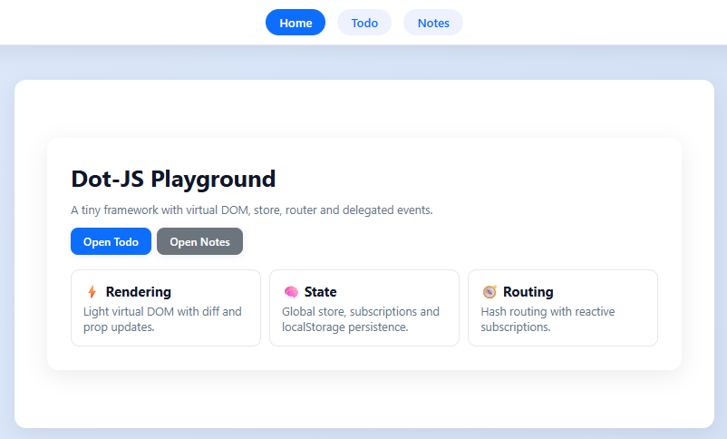
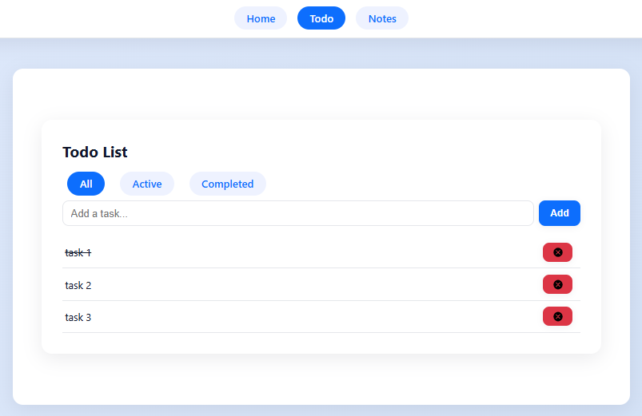
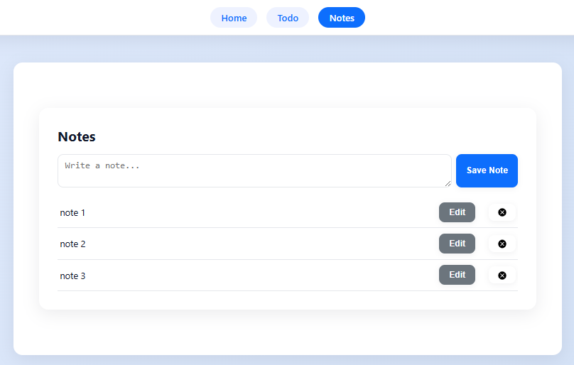

# Dot JS Example App

A demo Todo and Notes application built with Dot-js.

---

## How to run

1. Install dependencies:
   ```
   npm install
   ```
2. Start dev server:
   ```
   npm run dev
   ```
3. Open [http://localhost:5173](http://localhost:5173) in your browser.

---

## Features

- State management with localStorage
- Routing between Home, Todo, Notes
- Reusable components (TaskItem, TodoSection, Stats)
- Event delegation for all user actions
- HTTP requests demo (see Todo fetch)
- Performance demo (virtual list for large lists)

---

## Project Structure

```
example/
├── src/
│   ├── app.ts
│   ├── store.ts
│   ├── components/
│   │   ├── Stats.ts
│   │   ├── TaskItem.ts
│   │   └── TodoSection.ts
│   └── pages/
│       ├── Home.ts
│       ├── Notes.ts
│       └── Todo.ts
├── public/
│   └── icons/
│       └── delete.svg
├── style.css
├── index.html
├── screenshot/
│   ├── img1.png
│   ├── img2.png
│   └── img3.png
```

---

## Screenshots

### Main Page



The main page introduces Dot-JS Playground, showing navigation and key features: rendering, state, and routing.

---

### Todo List



The Todo List lets you add tasks, mark them as completed, delete tasks, and filter by all, active, or completed.  
You can manage your tasks efficiently and see their status at a glance.

---

### Notes



The Notes page allows you to write new notes, edit and save existing notes, and delete notes.  
It's a simple way to keep track of your ideas and tasks.

---

## How to use

- Add, edit, and delete todos and notes.
- State persists between sessions.
- Navigate between pages using the navbar.
- Try the virtual list demo for performance.

---

## Troubleshooting

| Problem                        | Solution                                      |
|---------------------------------|-----------------------------------------------|
| State not updating              | Ensure you use `store.setState` for changes   |
| UI not re-rendering             | Check that your component uses `useStore()`   |
| Routing not working             | Verify route definitions and URL format       |
| HTTP requests fail              | Check API endpoint and CORS settings          |
| Button/element not visible      | Check CSS and element structure               |
| localStorage issues             | Clear browser storage and reload              |

---

## Extending the Example

- To add a new page:
  1. Create a new file in `src/pages/`
  2. Export a function component
  3. Add route in `app.ts` or router config

- To add a new component:
  1. Create a new file in `src/components/`
  2. Export a function component
  3. Import and use in your page/component

---


