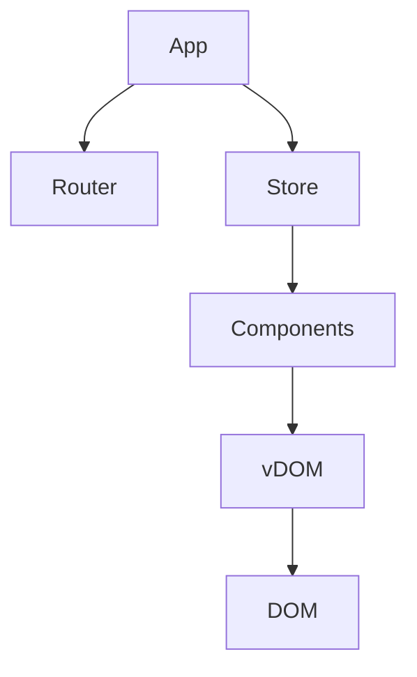

# Dot-js Framework

A lightweight, React-like front-end framework for building modern web applications with JavaScript.  
Dot-js includes state management, routing, a virtual DOM renderer, delegated event handling, DOM utilities, and a tiny HTTP client.

---

## Table of Contents

- [Overview](#overview)
- [Architecture](#architecture)
- [Installation](#installation)
- [Getting Started](#getting-started)
- [API Reference](#api-reference)
- [Best Practices](#best-practices)
- [Troubleshooting](#troubleshooting)
- [Performance](#performance)
- [Extending Your App](#extending-your-app)
- [FAQ](#faq)
- [How-To Guides](#how-to-guides)
- [Screenshots](#screenshots)

---

## Overview

Dot-js is implemented from scratch, with no external UI frameworks.  
It provides a familiar, React-like structure for building apps quickly and efficiently.

---

## Architecture



- **Components**: Pure functions returning virtual DOM nodes.
- **VDOM**: Lightweight description of DOM, diffed for efficient updates.
- **Store**: Centralized state management.
- **Router**: URL-based navigation and page rendering.
- **Events**: Delegated event handling for performance.
- **HTTP**: Simple fetch wrapper for API calls.

---

## Installation

```bash
git clone https://gitea.kood.tech/robinpall/frontend-framework.git
cd frontend-framework
npm install
npm run dev
```

Or use as a local workspace alias (see `vite.config.ts`):

```ts
resolve: { alias: { "@dotjs/framework": path.resolve(__dirname, "framework/src") } }
```

---

## Getting Started

See [Getting Started Guide](../../docs/getting-started.md) for a step-by-step tutorial.

---

## API Reference

### VDOM

```ts
import { h, mount } from "@dotjs/framework";

const view = h("div", { className: "box", style: { padding: "8px" } }, [
  h("button", { onClick: () => console.log("clicked") }, "Click me")
]);

mount(view, document.getElementById("app"));
```

Props support:
- `className`, `style` (object), boolean attributes, standard DOM attributes, and event props starting with `on` (e.g., `onClick`, `onInput`, `onSubmit`).

---

### State Management

```ts
import { createStore } from "@dotjs/framework";

type State = { count: number };
const store = createStore<State>({ count: 0 });

store.subscribe(() => render());

function inc() { store.setState(s => ({ count: s.count + 1 })); }
function dec() { store.setState(s => ({ count: s.count - 1 })); }

function App() {
  const { count } = store.getState();
  return h("div", null, [
    h("button", { onClick: dec }, "-"),
    h("span", null, String(count)),
    h("button", { onClick: inc }, "+"),
  ]);
}
```

- Use immutable updates.
- Subscribe to trigger re-renders.
- Persist and hydrate state externally (e.g., `localStorage`).

---

### Routing

```ts
import { createRouter, mount, h } from "@dotjs/framework";

const routes = {
  "/": () => h("div", null, "Home"),
  "/about": () => h("div", null, "About"),
  "/todos/:id": ({ id }: any) => h("div", null, `Todo ${id}`),
};

const router = createRouter(routes, () => h("div", null, "Not found"));
router.subscribe(render);

function render() {
  const match = router.getCurrent();
  const vnode = match.component ? match.component(match.params) : null;
  mount(vnode!, document.getElementById("app")!);
}
```

- Supports `hash` (default) and `history` modes.
- `navigate(path)` changes the URL programmatically.

---

### Event Handling (Delegated)

- Attach handlers in props: `onClick`, `onInput`, `onSubmit`, etc.
- Handlers may return `false` to `preventDefault()` and `stopPropagation()` when using delegated events.
- To enable a delegated event globally, call from app setup:

```ts
import { addDelegatedEvent } from "@dotjs/framework";
addDelegatedEvent("click");
addDelegatedEvent("input");
addDelegatedEvent("submit");
```

---

### HTTP

```ts
import { http } from "@dotjs/framework";

const res = await http.get<{ items: string[] }>("/api/items");
```

- `http.safe(url, options)` returns `{ ok: true, body } | { ok: false, error }`.

---

## Best Practices

- Keep components pure; derive UI from props + global state.
- Use immutable updates in the store; subscribe once at the app root to re-render.
- Prefer delegated events for high event volumes.
- Co-locate small helpers with components; keep side effects at boundaries (store, router, HTTP).
- For very large lists, use list virtualization (render only visible items).

---

## Troubleshooting

| Problem                | Solution                                 |
|------------------------|------------------------------------------|
| State not updating     | Use `store.setState` and subscribe       |
| Routing not working    | Check route definitions and URL format   |
| HTTP errors            | Check endpoint and CORS settings         |
| UI not re-rendering    | Ensure you use `useStore()` in components|
| Button not visible     | Check CSS and element structure          |
| localStorage issues    | Clear browser storage and reload         |

---

## Performance

- Delegated events reduce listener churn and memory.
- Virtual DOM minimizes DOM updates.
- VirtualList renders only visible items for large lists.

**Performance Test Example:**

```ts
const bigArray = Array.from({ length: 10000 }, (_, i) => ({ id: i, text: `Item ${i}` }));
h(VirtualList, { items: bigArray, visibleCount: 50 });
```

---

## Extending Your App

- Add new pages in `src/pages/`
- Add new components in `src/components/`
- Register new routes in `router.ts`

---

## FAQ

**Q: How do I persist state?**  
A: State is saved to localStorage automatically.

**Q: How do I add global styles?**  
A: Use a global CSS file and import it in your HTML.

---

## How-To Guides

- [Getting Started](../docs/getting-started.md)
- [How To Use Components](../docs/how-to-components.md)
- [How To Use Routing](../docs/how-to-route.md)
- [How To Use CRUD with HTTP](../docs/how-to-crud.md)
- [Parent-Child Components](../docs/how-to-component-sharing.md)

---

## Screenshots

See [example/README.md](../example/README.md) for screenshots of the demo app.
